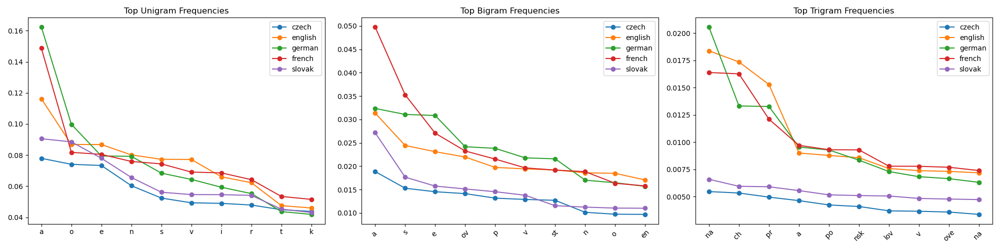

Link to [GitHub](https://github.com/WinterKRALLe/LangDetection)

Install dependencies:
```python
pip install -r requirements.txt
```
or
```shell
nix-shell
```
Can be run with:
```python
python natural_lang/main.py
```
and
```python
python programming_lang/main.py
```

## Výsledky natural language classification:  
  
`text = "Bratislava je hlavné mesto Slovenskej republiky."`  
{'czech': 0.0009712602834479258, 'english': 3.576038793303323e-12, 'german': 3.2959370843747114e-11, 'french': 6.050132573806746e-12, 'slovak': 0.9990287396739667}
<p align="center">
<br/>
</p>
  
## Výsledky prgramming language classification:  
  
`code = """
    calculate_sum = (a, b) => a + b
"""`  
Probabilities: {'python': 1.3868541505327953e-07, 'javascript': 0.999999861314585}  
Explanation: {'javascript': ['Found 1 characteristic patterns']}